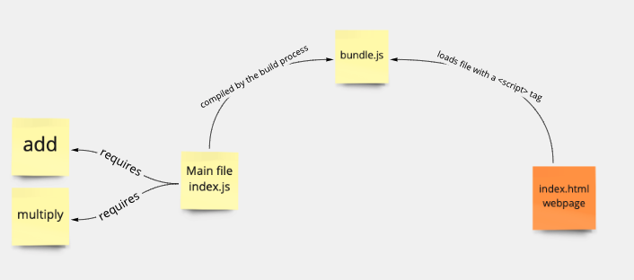

# Using a build tool

## Objectives

 * Use esbuild to bundle JavaScript files.

## Bundling our code

JavaScript programs are usually composed of many different files. As we add more
files (functions, classes, etc) to our application, the number of files to load
on the page is becoming harder to manage.

To avoid this, we can use what is called a *build tool*. Most modern JavaScript
codebases will use some kind of build tool as part of their tooling.

We'll use [`esbuild`](https://esbuild.github.io/getting-started/) as it is
simple enough for us to get started without doing too much configuration.
**You'll need to install it globally using `npm`:**

```bash
$ npm install -g esbuild
```

## Exercise One

**In the same project directory** than for the previous section (`example-1`), we'll use
`esbuild` to "bundle" our main source file `index.js` into a new file
`bundle.js` — we'll also refer to this file as the **bundle file** (nothing to
do with Ruby's `bundle` though!).

1. In a new terminal (and in the exercise directory), run the command `npm run
   build`. **Keep this process running in the background.**

You should get the following output:
```bash
> esbuild index.js --bundle  --outfile=bundle.js --watch

[watch] build finished, watching for changes...
```
2. Observe the contents of the exercise directory — there should be a new file
   called `bundle.js`.
3. Update the `<script>` tag inside the HTML page to point to this new file,
   instead of `index.js`.
4. Reload the HTML page in your browser and verify in the console **that you can
   see the same output as before.**

### Troubleshooting common problems

If this last step doesn't work, it's likely because:
* the command `npm run build` didn't work as expected — make sure you installed
  `esbuild` globally with `npm install -g esbuild`, and that you run `npm
  install` in the project directory.
* the `<script>` tag is incorrect, or doesn't point to the right file.

In the next section, you'll learn how to bundle different JS files (or
**modules**) into a single bundle file.


### A Reminder about JS modules

Remember that a function is exported from its file using `module.exports`, and
required from another file using `require`:

```js
// myFunction.js

const myFunction = () => { <!-- OMITTED --> };

module.exports = myFunction;
```

```js
// index.js
const myFunction = require('./myFunction');

// ...
```

## Exercise Two

**Work in the same project directory** than in the previous section (`example-1`).

1. In a new file `add.js`, define and export a function `add`, which returns the
   sum of two numbers.
2. In a new file `multiply.js`, define and export a function `multiply`, which
   returns the product of two numbers.
3. In the main file, **require and use the two previous functions to calculate
   `(2 + 2) * 4` and print the result to the console (16)**.
4. Make sure to run `npm run build` to regenerate the bundle file (if that
   command wasn't already running in a terminal). Also make sure the bundle file
   is loaded by the HTML page `index.html`.
5. Open the page and verify the result is printed in the console.
6. Change the numbers in the operation in `index.js` — the file `bundle.js`
   should be automatically regenerated and, after refreshing the page, you
   should see a new result in the console.

<details>
  <summary>Reveal suggested walkthrough</summary>

  1. Contents of `add.js`:
  ```js
  module.exports = (a, b) => {
    return a + b;
  }
  ```

  2. Contents of `multiply.js`:
  ```js
  module.exports = (a, b) => {
    return a * b;
  }
  ```

  3. Contents of `index.js`:
  ```js
  const add = require('./add');
  const multiply = require('./multiply');

  console.log(multiply(add(2, 2), 4));
  ```

  4. Command to run to generate the bundled file:
  ```bash
  $ npm run build
  ```

  5. HTML code loading the bundled file:
  ```html
  <!DOCTYPE html>
  <html lang="en">
  <head>
    <title>Hello JavaScript</title>
  </head>
    <body>
      <!-- ... -->
      <script type="text/javascript" src="bundle.js"></script>
    </body>
  </html>
  ```

  6. You should see the result (16) printed in the browser console.
</details>

## Diagram

Here's a diagram of how a build tool such as esbuild compiles different source
files into a bundle file loaded by the browser:




[Next Challenge](03_notes_app_scaffold.md)

<!-- BEGIN GENERATED SECTION DO NOT EDIT -->

---

**How was this resource?**  
[😫](https://airtable.com/shrUJ3t7KLMqVRFKR?prefill_Repository=makersacademy/javascript-web-applications&prefill_File=contents/02_build_tool.md&prefill_Sentiment=😫) [😕](https://airtable.com/shrUJ3t7KLMqVRFKR?prefill_Repository=makersacademy/javascript-web-applications&prefill_File=contents/02_build_tool.md&prefill_Sentiment=😕) [😐](https://airtable.com/shrUJ3t7KLMqVRFKR?prefill_Repository=makersacademy/javascript-web-applications&prefill_File=contents/02_build_tool.md&prefill_Sentiment=😐) [🙂](https://airtable.com/shrUJ3t7KLMqVRFKR?prefill_Repository=makersacademy/javascript-web-applications&prefill_File=contents/02_build_tool.md&prefill_Sentiment=🙂) [😀](https://airtable.com/shrUJ3t7KLMqVRFKR?prefill_Repository=makersacademy/javascript-web-applications&prefill_File=contents/02_build_tool.md&prefill_Sentiment=😀)  
Click an emoji to tell us.

<!-- END GENERATED SECTION DO NOT EDIT -->
