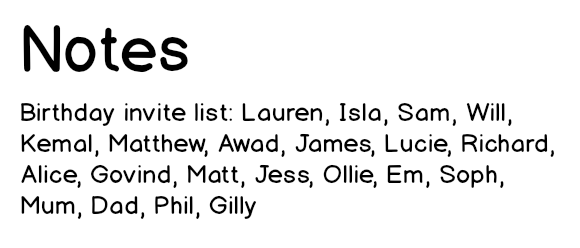

# Build a notes app - frontend

## Objectives
 * Build a single page frontend application in JS from scratch.

To complete this challenge, you'll need to:
 * use `fetch` to send requests to the notes app backend
 * use DOM functions to update the webpage with data received from the backend
 * handle user interaction with event listeners
 * use a build tool to bundle the JS code for the browser

## Running the notes backend 

To work on this exercise, you'll have to use [the notes backend web server (download zip here)](https://github.com/makersacademy/javascript-web-applications/blob/main/resources/notes-backend-server.zip). You can run it using `node index.js`, and it should be able to receive `GET` and `POST` HTTP requests. You should be able to launch it using `node index.js`. This web server is made using express and implement two HTTP endpoints:

 * `GET /notes` - gets the list of notes
 * `POST /notes` - adds a new note with a JSON body such as `'{"title":"Groceries list", "content": "Tomatoes, yoghurt, honey, milk"}'`

You can also [experiment with the `curl` command to verify the endpoints are working](#testing-the-notes-backend-with-curl).

## User stories

Here are the user stories for the notes app project — they'll indicate which features the web interface should implement:

```
As a programmer
I can see a list of my notes, where each note is abbreviated to the first 20 characters
So I can find the one I want
```

```
As a programmer
I can create a new note
So I can record something I need to remember
```

```
As a programmer
I can see the full text of an individual note on its own page
So I can see all the information in the note
```

Below is a more detailed guidance on how you can approach the project in different steps:

## 1. Project setup

To complete this part, you'll need to:
 * Initialise a new project directory with `npm` and Jest.
 * Create a page `index.html` containing a basic HTML structure.

## 2. Adding a new note

To complete this part, you'll need to:
 * Add a small form on the page, with a text input for the new note title, a text input for the new note content, and a button.
 * Use an event listener on the button - when the button is clicked, [send a JSON POST request to the backend endpoint with the contents of the text input](https://developer.mozilla.org/en-US/docs/Web/API/Fetch_API/Using_Fetch#uploading_json_data).
 * Add the new note contents on the page.

## 3. Displaying the list of notes

To complete this part, you'll need to:
 * Use `fetch` to send an HTTP request to the endpoint to retrieve the list of notes.
 * Update the contents on the page with the list of notes.
 * This should happen when the page is loaded.

## Mockup of the UI




## Testing the notes backend with curl

To explore the backend server endpoints, you can use `curl` (with the utility command `jq` to pretty-print the JSON response) — it should respond to the following HTTP requests, in order:

```bash
curl -s -XGET http://localhost:3000/notes | jq

[]
```

```bash
curl -s -XPOST -H 'content-type: application/json' http://localhost:3000/notes -d '{"title":"Groceries list", "content": "Tomatoes, yoghurt, honey, milk"}' | jq

{
  "title": "Groceries list",
  "content": "Tomatoes, yoghurt, honey, milk"
}
```

```bash
curl -s -XGET http://localhost:3000/notes | jq

[
  {
    "title": "Groceries list",
    "content": "Tomatoes, yoghurt, honey, milk"
  }
]
```

```bash
curl -s -XPOST -H 'content-type: application/json' http://localhost:3000/notes -d '{"title":"Birthday present", "content": "Remember to buy birthday present for Max"}' | jq

{
  "title": "Birthday present",
  "content": "Remember to buy birthday present for Max"
}
```

```bash
curl -s -XGET http://localhost:3000/notes | jq

[
  {
    "title": "Groceries list",
    "content": "Tomatoes, yoghurt, honey, milk"
  },
  {
    "title": "Birthday present",
    "content": "Remember to buy birthday present for Max"
  }
]
```


<!-- BEGIN GENERATED SECTION DO NOT EDIT -->

---

**How was this resource?**  
[😫](https://airtable.com/shrUJ3t7KLMqVRFKR?prefill_Repository=makersacademy/javascript-web-applications&prefill_File=contents/07_notes_app_frontend.md&prefill_Sentiment=😫) [😕](https://airtable.com/shrUJ3t7KLMqVRFKR?prefill_Repository=makersacademy/javascript-web-applications&prefill_File=contents/07_notes_app_frontend.md&prefill_Sentiment=😕) [😐](https://airtable.com/shrUJ3t7KLMqVRFKR?prefill_Repository=makersacademy/javascript-web-applications&prefill_File=contents/07_notes_app_frontend.md&prefill_Sentiment=😐) [🙂](https://airtable.com/shrUJ3t7KLMqVRFKR?prefill_Repository=makersacademy/javascript-web-applications&prefill_File=contents/07_notes_app_frontend.md&prefill_Sentiment=🙂) [😀](https://airtable.com/shrUJ3t7KLMqVRFKR?prefill_Repository=makersacademy/javascript-web-applications&prefill_File=contents/07_notes_app_frontend.md&prefill_Sentiment=😀)  
Click an emoji to tell us.

<!-- END GENERATED SECTION DO NOT EDIT -->
