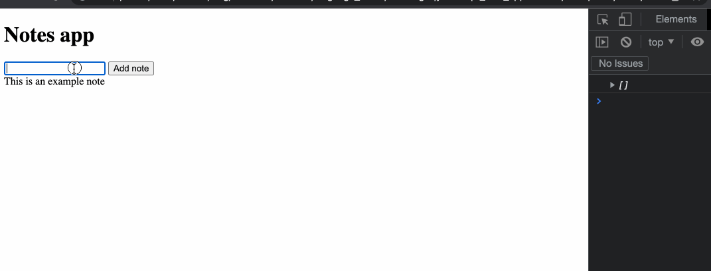

# Test-driving the form to add a new note

## Objectives

 * Use JavaScript to handle a click and read an input value.
 * Modify the page in reaction to user interaction.

For this challenge, **we'll go back to our Notes app project** — in the `notes-app` directory.
You'll now apply these skills to add some functionality to the notes app, so 
that **the user can add a new note on the page by clicking on a button**.

We'll test-drive changes to the `NotesView` class so that it will:
 * handle user interaction
 * save a new note to the model
 * display the updated list of notes
 
You can refer to the previous sections and exercises to help you through this
task.

## Challenge

You'll need to:
 * Add a new text input and button to the web page.
 * Test-drive and implement the JS code that allows the user to input a new note title,
   click the button, and see the new note displayed on the page.
    * you should set an event listener in the `NotesView` constructor.
    * the model's `addNote` method should be called to save the new note on the model.
    * you should use the `displayNotes` method to reflect these changes on the page.

Below is an example result of what you should see when using the web page:




<details>
  <summary>Reveal suggested walkthrough</summary>

  1. Update the web page to add:
      * an HTML text input to enter the note content
      * a submit button to add the note

      ```html
        <h1>Notes app</h1>

        <input type="text" id="add-note-input" />
        <button id="add-note-btn">Add note</button>

        <div id="main-container">

        </div>
      ```


  2. Write a new test in `notesView.test.js` which:
      * sets up the model and view instances
      * sets the value of the text input to `'This is a new test note'`
      * clicks the submit button
      * then asserts there is a new note element on the page with the contents `'This is a
        new test note'`

      ```js
      // notesView.test.js

      // ...
      it('adds a new note', () => {
        document.body.innerHTML = fs.readFileSync('./index.html');

        const model = new NotesModel();
        const view = new NotesView(model);

        // 1. Fill the input
        const input = document.querySelector('#add-note-input');
        input.value = 'My new amazing test note';

        // 2. Click the button
        const button = document.querySelector('#add-note-btn');
        button.click();

        // 3. The note should be on the page
        expect(document.querySelectorAll('div.note').length).toEqual(1);
        expect(document.querySelectorAll('div.note')[0].innerText).toEqual('My new amazing test note');
      });
      ```

  3. Modify the code in the `NotesView` class so the test passes.

      ```js
      // notesView.js

      class NotesView {
        constructor(model) {
          this.model = model;
          this.mainContainerEl = document.querySelector('#main-container');

          document.querySelector('#add-note-btn').addEventListener('click', () => {
            const newNote = document.querySelector('#add-note-input').value;
            this.addNewNote(newNote);
          });
        }

        addNewNote(newNote) {
          this.model.addNote(newNote);
          this.displayNotes();
        }

        // ...
      }
      ```

</details>

## Further improvements

You can notice two slightly annoying bugs in our program now:
 * first, the elements keep being *added* on the page when we refresh the list of notes,
   but the older ones are not removed.
 * second, it would be nice to clear the input's value once the new note is created.

We'll fix those two issues in the next section.


[Next Challenge](11_fixing_list_refresh.md)

<!-- BEGIN GENERATED SECTION DO NOT EDIT -->

---

**How was this resource?**  
[😫](https://airtable.com/shrUJ3t7KLMqVRFKR?prefill_Repository=makersacademy/javascript-web-applications&prefill_File=contents/10_adding_a_note_ui.md&prefill_Sentiment=😫) [😕](https://airtable.com/shrUJ3t7KLMqVRFKR?prefill_Repository=makersacademy/javascript-web-applications&prefill_File=contents/10_adding_a_note_ui.md&prefill_Sentiment=😕) [😐](https://airtable.com/shrUJ3t7KLMqVRFKR?prefill_Repository=makersacademy/javascript-web-applications&prefill_File=contents/10_adding_a_note_ui.md&prefill_Sentiment=😐) [🙂](https://airtable.com/shrUJ3t7KLMqVRFKR?prefill_Repository=makersacademy/javascript-web-applications&prefill_File=contents/10_adding_a_note_ui.md&prefill_Sentiment=🙂) [😀](https://airtable.com/shrUJ3t7KLMqVRFKR?prefill_Repository=makersacademy/javascript-web-applications&prefill_File=contents/10_adding_a_note_ui.md&prefill_Sentiment=😀)  
Click an emoji to tell us.

<!-- END GENERATED SECTION DO NOT EDIT -->
