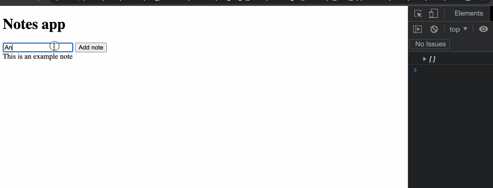

# Fixing the notes refresh

In the previous section, we've implemented code so the user can type in a new
note and submit it, and refresh the list of notes on the page.

However, we also need to "clear" the list of note elements that were *already*
on the page before creating new ones.

## Exercise - clearing previous notes

This task is going to be made slightly easier thanks to the fact all our note
elements have the HTML class `note`, so we know which ones to remove from the
page. To complete this task, you'll have to research how to remove all elements
having the same class.

1. In the test file `messageView.test.js`, add a new test case for
   `displayNotes` that verifies that, when that method is called **twice**,
   there should still be the right number of notes from the model on the page.

2. Watch this test fail, and update now the code of the `displayNotes` method to
   make it pass.

3. When trying the change on the web page, you should get a similar result:



<details>
  <summary>Reveal suggested walkthrough</summary>


  ```js
  // notesView.test.js

  // ...

  it('clear the list of previous notes before displaying', () => {
    document.body.innerHTML = fs.readFileSync('./index.html');

    const model = new NotesModel();
    const view = new NotesView(model);
    model.addNote('one');
    model.addNote('two');

    view.displayNotes();
    view.displayNotes();

    expect(document.querySelectorAll('div.note').length).toEqual(2);
  });

  // ...
  ```

  ```js
  // notesView.js

  displayNotes() {
    // 1. Remove all previous notes
    document.querySelectorAll('.note').forEach(element => {
      element.remove();
    });

    const notes = this.model.getNotes()

    // For each note, create and append a new element on the main container
    notes.forEach(note => {
      const noteEl = document.createElement('div');
      noteEl.innerText = note;
      noteEl.className = 'note';
      this.mainContainerEl.append(noteEl);
    })
  }
  ```
</details>

## Bonus exercise - clearing the input

1. It would also be nice if the text input would reset to an empty value after
   the user clicked the button. Use the `.value` property of the input element
   to reset it to a blank state.

You should now get the following result when adding a new note:


## Saving state

You'll notice that, if we reload the page, we'll loose our list of notes — this
is because the notes, as all variables, are stored in memory by JavaScript.
**Every variable we use in the browser** will be lost once the user reloads the
page. We'll soon learn how we can fetch and update the state of our notes app on
a remote server.

[Next Challenge](15_discovering_fetch.md)

<!-- BEGIN GENERATED SECTION DO NOT EDIT -->

---

**How was this resource?**  
[😫](https://airtable.com/shrUJ3t7KLMqVRFKR?prefill_Repository=makersacademy/javascript-web-applications&prefill_File=contents/14_fixing_list_refresh.md&prefill_Sentiment=😫) [😕](https://airtable.com/shrUJ3t7KLMqVRFKR?prefill_Repository=makersacademy/javascript-web-applications&prefill_File=contents/14_fixing_list_refresh.md&prefill_Sentiment=😕) [😐](https://airtable.com/shrUJ3t7KLMqVRFKR?prefill_Repository=makersacademy/javascript-web-applications&prefill_File=contents/14_fixing_list_refresh.md&prefill_Sentiment=😐) [🙂](https://airtable.com/shrUJ3t7KLMqVRFKR?prefill_Repository=makersacademy/javascript-web-applications&prefill_File=contents/14_fixing_list_refresh.md&prefill_Sentiment=🙂) [😀](https://airtable.com/shrUJ3t7KLMqVRFKR?prefill_Repository=makersacademy/javascript-web-applications&prefill_File=contents/14_fixing_list_refresh.md&prefill_Sentiment=😀)  
Click an emoji to tell us.

<!-- END GENERATED SECTION DO NOT EDIT -->
