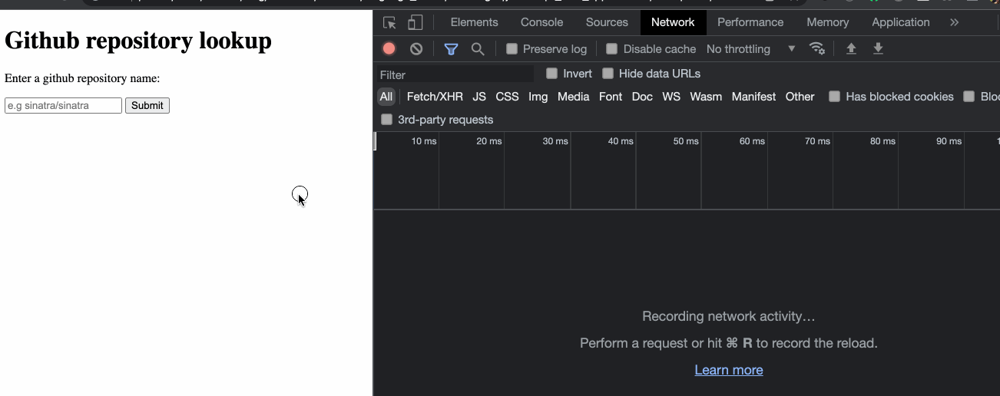

# Making HTTP requests with fetch

## Objectives

 * Understand how the `fetch` function can be used to make an HTTP request.
 * Use the response data received by `fetch` to modify the page.

In this section, you will **discover with an example** how we can use JavaScript
code to make network HTTP requests to a remote server, this way we can call
remote APIs to fetch, create or update data.

## Downloading the exercise scaffold

You'll need to download [the last provided exercise scaffold for this
section](../resources/example-4.zip). Unzip this in your projects directory and
open it in your code editor. Run the usual setup with `npm install` and `npm run
build`.

1. Have a look at the `index.html` file and notice the structure of the HTML
   page.
2. Now have a look at the different JS files. You'll notice classes you're now
   familiar with — a model class which holds data, and a view which uses event
   listeners.
3. Inside the code for the `GithubApi` class (`githubApi.js`), you'll notice
   something new — the `fetch` function.
4. In your browser, open the HTML page, type in a Github repository name (such
   as 'sinatra/sinatra'), then click the button. You should see some information
   about this repository displayed in the developer console.


## Exercise - displaying the info on the page

1. So far, the code only prints the repository data in the console. Add code to
   the `GithubView` class so it also calls `display()` — this method should:
    * sets the `full_name` property of the repo data to the HTML element
      `#repo-name`.
    * sets the `description` property of the repo data to the HTML element
      `#repo-description`.

2. We also want to display the repo's profile picture:
    * Add a new element `` on the page, and add the required JS code so it
      displays the image (the image URL can be found under the property
      `organization.avatar_url`). You'll have to research how we can dynamically
      set the HTML image's source URL with JavaScript.


## About the JSON format

The Github API is responding with the JSON format — a format commonly used in
web APIs. If you're curious to see what JSON looks like, you can open directory
the API URL for Sinatra's repo information in your web browser:
[https://api.github.com/repos/sinatra/sinatra](https://api.github.com/repos/sinatra/sinatra).

```json
{
  "id": 106995,
  "node_id": "MDEwOlJlcG9zaXRvcnkxMDY5OTU=",
  "name": "sinatra",
  "full_name": "sinatra/sinatra",
  "private": false,
  // (omitted for brevity)
}
```

You'll notice this format is really close to **JavaScript objects** format,
which is why it's simple to decode into a JS object, which is exactly what this
part of the code is doing:
```js
fetch('https://api.github.com/repos/' + repoName)
  .then(response => response.json()) // 1. convert JSON to JS object
  .then(data => {
    // 2. `data` is now a full JS object, so we can access its properties  
    callback(data)
  });
```

The function `fetch` and the JSON format can also be used to *send* HTTP request
data to the remote server (for example, `POST` requests) — we'll learn about
this in a few moments.

## Diagram

This diagram recapitulates how the previous exercise works, using `fetch` to
request data from Github's API, so we can modify the page to display it.


## Inspecting the request with the developer tools

You might have previously used the [Developer console's
Network](https://developer.chrome.com/docs/devtools/network/) tab to inspect
HTTP requests (and responses) sent (and received) by the browser — since `fetch`
sends HTTP requests, we can also inspect it using the same tool. Head to the
`Network` tab of the console and interact with the page again to display a
repo's information:



This can help us debug HTTP requests made by `fetch` (e.g HTTP method, headers,
etc).

## Additional resources

 * [How to use fetch](https://javascript.info/fetch)


[Next Challenge](16_connecting_to_server.md)

<!-- BEGIN GENERATED SECTION DO NOT EDIT -->

---

**How was this resource?**  
[😫](https://airtable.com/shrUJ3t7KLMqVRFKR?prefill_Repository=makersacademy/javascript-web-applications&prefill_File=contents/15_discovering_fetch.md&prefill_Sentiment=😫) [😕](https://airtable.com/shrUJ3t7KLMqVRFKR?prefill_Repository=makersacademy/javascript-web-applications&prefill_File=contents/15_discovering_fetch.md&prefill_Sentiment=😕) [😐](https://airtable.com/shrUJ3t7KLMqVRFKR?prefill_Repository=makersacademy/javascript-web-applications&prefill_File=contents/15_discovering_fetch.md&prefill_Sentiment=😐) [🙂](https://airtable.com/shrUJ3t7KLMqVRFKR?prefill_Repository=makersacademy/javascript-web-applications&prefill_File=contents/15_discovering_fetch.md&prefill_Sentiment=🙂) [😀](https://airtable.com/shrUJ3t7KLMqVRFKR?prefill_Repository=makersacademy/javascript-web-applications&prefill_File=contents/15_discovering_fetch.md&prefill_Sentiment=😀)  
Click an emoji to tell us.

<!-- END GENERATED SECTION DO NOT EDIT -->
